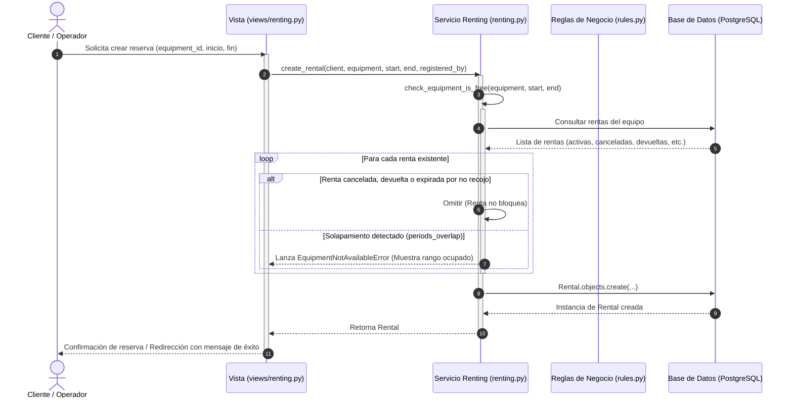

# Diagrama de Secuencia: Proceso de Renta de Equipos

```mermaid
sequenceDiagram
    autonumber
    actor C as Cliente / Operador
    participant V as Vista (views/renting.py)
    participant S as Servicio Renting (renting.py)
    participant R as Reglas de Negocio (rules.py)
    participant DB as Base de Datos (PostgreSQL)

    %% Inicio del Flujo
    C->>V: Solicita crear reserva (equipment_id, inicio, fin)
    activate V

    V->>S: create_rental(client, equipment, start, end, registered_by)
    activate S

    %% Validaciones del equipo y fechas
    S->>S: check_equipment_is_free(equipment, start, end)
    activate S
    S->>DB: Consultar rentas del equipo
    DB-->>S: Lista de rentas (activas, canceladas, devueltas, etc.)
    
    loop Para cada renta existente
        alt Renta cancelada, devuelta o expirada por no recojo
            S->>S: Omitir (Renta no bloquea)
        else Solapamiento detectado (periods_overlap)
            S-->>V: Lanza EquipmentNotAvailableError (Muestra rango ocupado)
        end
    end
    deactivate S

    %% Creación de la Renta
    S->>DB: Rental.objects.create(...)
    DB-->>S: Instancia de Rental creada

    S-->>V: Retorna Rental
    deactivate S

    V-->>C: Confirmación de reserva / Redirección con mensaje de éxito
    deactivate V
```