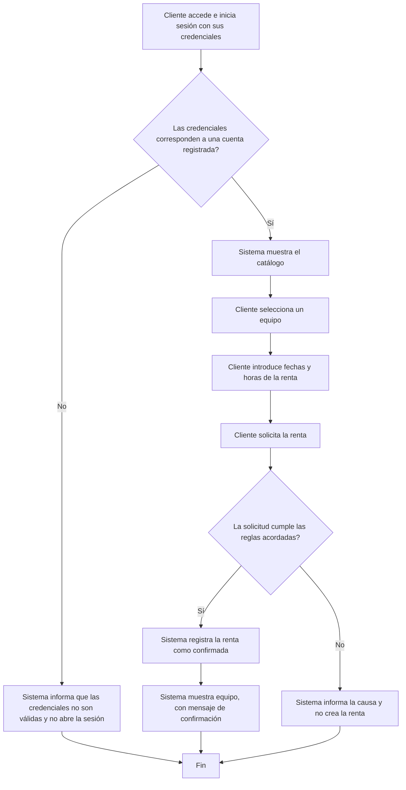

# Sesión 7 — Historias, casos de uso y modelos

- Proyecto: SergioCorp
- Integrantes: Sofia Arduz Rengel, Andres Laura Vargas, Peter Uriel Terán Bedregal
- Fecha: 02/10/2026
- Requisitos de origen: [Sesión 6](sesion-06-requisitos.md)
- Flujo seleccionado: Renta de un equipo realizado por un cliente
- IDs seleccionados y estado de aprobación: [IDs y estado]

## 1. Historia [ID-HU-01]

Como cliente, quiero ingresar al sistema con mis credenciales, elegir el equipo que quiero rentar, reservar con fechas de retiro y devolución y recibir la confirmación para realizar la renta de un equipo. 

- Requisitos relacionados: 
  - PRE-01: Registrar equipos individuales con identificador, descripción y estado; registrar solicitantes.
  - PRE-02: Consultar equipos y su disponibilidad, con filtros relevantes.
  - PRE-03: Registrar un préstamo con equipo, persona, entrega y vencimiento.

## 2. Caso de uso: ID-CU-01 — El cliente renta un equipo

- Objetivo: Rentar un equipo  
- Actor principal: Cliente  
- Disparador: La página web  
- Precondiciones:   
  El cliente ya tiene su usuario en el sistema.   
  El equipo existe en el inventario.   
  El estado del equipo es "disponible".
- Poscondición de éxito: Confirmación de la renta.
- Garantía ante rechazo: Se muestra como mensaje "no disponible".

### Flujo principal

a) Login
1. El cliente ingresa al login, inicia sesión.
2. El sistema compara los datos de ingreso con la base de datos.
3. Se aprueba o rechaza el ingreso al sistema.

b) Revisar catálogo
1. El cliente observa los equipos disponibles y selecciona el que quiere rentar.
2. El sistema confirma que el equipo está disponible.

c) Realizar renta
1. El usuario introduce fecha de retiro y de devolución y le da click a "aceptar" para rentar el equipo.
2. El sistema acepta la petición del equipo rentado.
3. Se cambia el estado del equipo a "rentado" y confirma la solicitud.

### E1 — Ruta de rechazo o excepción

a) Login 
- Ocurre en el paso: 1
- Condición: 
  - El nombre de usuario debe ser único
  - Debe ingresar la contraseña correcta
- Respuesta del sistema: Este nombre de usuario ya existe
- Estado final y datos que se conservan: No se espera ningún dato (pendiente de aprobación)
- El caso termina o continúa en: Pantalla de inicio de sesión

b) Revisar catálogo
- Ocurre en el paso: 2
- Condición: El equipo no está disponible
- Respuesta del sistema: El sistema mostrará el siguiente mensaje: "El equipo no está disponible"
- Estado final y datos que se conservan: Información de disponibilidad del equipo 
- El caso termina o continúa en: El sistema devuelve al usuario a la pantalla de inicio (catálogo principal)

## 3. Modelo [ID-MOD-01]

- Tipo elegido: Diagrama de flujo simplificado
- Pregunta que responde: ¿Como se renta un equipo y cuáles son las excepciones?
- Alcance y aspectos que deja fuera: 
  - Se ignora la concurrencia de solicitudes
  - No se toma en cuenta las atribuciones de un super-usuario/ operador
  - No se puede rentar más de un equipo a la vez
  - No se consideran todos los estaod que puede tener un equipo

## 4. Estados o efectos sobre los datos
- Entidad que se está modelando: [...]

| Estado actual | Evento y condición | Estado siguiente | Efecto sobre los datos |
|---|---|---|---|
| [...] | [...] | [...] | [...] |
| [...] | [...] | [...] | [...] |

[Si no corresponde una tabla de estados, explicar por qué e indicar los cambios y la conservación de datos.]

## 5. Trazabilidad

| Requisito de sesión 6 | Historia / caso de uso | Paso o rama del modelo | Escenario de aceptación relacionado |
|---|---|---|---|
| [ID] | [IDs] | [paso/rama] | [caso normal, límite o rechazo; enlace o referencia exacta] |

Los escenarios se han recorrido sobre el modelo; eso no equivale a ejecutar pruebas del programa.

## 6. Revisión recibida (no rellenar)

## 7. Dudas y cambios en los requisitos

| Requisito | Duda o cambio | Estado / confirmación del cliente | Impacto |
|---|---|---|---|
| [...] | [...] | [...] | [...] |

[Si no hubo cambios, indicarlo. Las correcciones aprobadas también deben quedar en el archivo de la sesión 6.]

## 8. Siguiente paso y participación

- Tarea de desarrollo derivada del modelo: [...]
- Requisito que la justifica: [...]
- Responsable inicial: [...]
- Issue existente o nuevo, si corresponde: [enlace]
- Aportes de cada integrante: [...]
- Asistencia de IA, si se utilizó: [herramienta, propósito, aporte y verificación]
