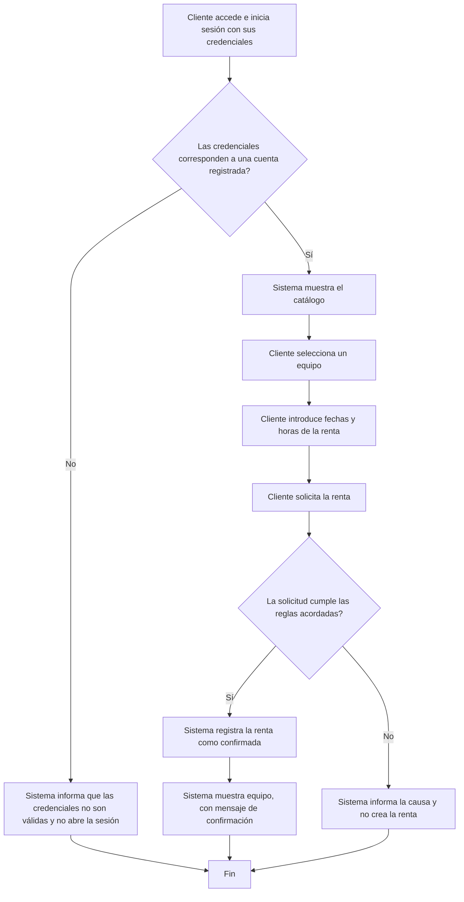

# Sesión 7 — Historias, casos de uso y modelos

- Proyecto: SergioCorp
- Integrantes: Sofia Arduz Rengel, Andres Laura Vargas, Peter Uriel Terán Bedregal
- Fecha: 02/10/2026
- Requisitos de origen: [Sesión 6](sesion-06-requisitos.md)
- Flujo seleccionado: Renta de un equipo realizado por un cliente
- IDs seleccionados y estado de aprobación: PRE-RF-01, aprobado por el cliente (el mensaje de rechazo sigue propuesto en PRE-RC-01). También usamos PRE-RF-04, aprobado, porque un equipo en revisión no se puede rentar.

## 1. Historia PRE-HU-01

Como cliente, quiero ingresar al sistema con mis credenciales, elegir el equipo que quiero rentar, indicar las fechas de recojo y devolución y recibir la confirmación, para tener el equipo en el momento en que lo necesito si está disponible.

- Requisitos relacionados:
  - PRE-RF-01: el primer cliente que confirma se queda el equipo para ese periodo.
  - PRE-RF-04: un equipo devuelto queda en revisión y no se puede rentar hasta que mantenimiento lo libere.
  - Del encargo: PRE-02 (consultar equipos y su disponibilidad) y PRE-03 (registrar la renta con equipo, persona, entrega y vencimiento). PRE-01 queda en las precondiciones: el cliente y el equipo ya están registrados.

## 2. Caso de uso PRE-CU-01 — El cliente renta un equipo

- Objetivo: que el cliente rente un equipo desde la página web para las fechas que elige, si el equipo está disponible en ese periodo.
- Actor principal: cliente.
- Disparador: el cliente entra a la página web para rentar un equipo.
- Precondiciones:
  - El cliente ya tiene su usuario en el sistema.
  - El equipo existe en el inventario.
- Poscondición de éxito: queda registrada una renta confirmada del cliente para ese equipo y esas fechas, y el cliente ve la confirmación.
- Garantía ante rechazo: no se crea ninguna renta y no cambia ninguna renta ni ningún equipo; el cliente ve un mensaje que explica por qué no se pudo.

### Flujo principal

Inicio de sesión

1. El cliente entra a la pantalla de inicio de sesión e ingresa su usuario y contraseña.
2. El sistema comprueba las credenciales.
3. El sistema abre la sesión y muestra el catálogo.

Revisar catálogo

4. El cliente revisa el catálogo y selecciona el equipo que quiere rentar.
5. El sistema muestra el equipo elegido y pide los datos de la renta.

Realizar renta

6. El cliente introduce la fecha y hora de recojo y la fecha y hora de devolución, y hace clic en "Aceptar".
7. El sistema comprueba que el equipo esté disponible en ese periodo: que no tenga otra renta confirmada que se cruce con esas fechas (PRE-RF-01) y que no esté en revisión (PRE-RF-04).
8. El sistema registra la renta como confirmada al instante, sin que nadie tenga que aprobarla (ENT-16). El equipo queda ocupado solo para ese periodo.
9. El sistema muestra la confirmación con el equipo, las fechas y el horario de recojo desde las 18:00.

### E1 — Equipo no disponible

- Ocurre en el paso: 7.
- Condición: el equipo no está disponible en las fechas elegidas, por ejemplo porque otro cliente confirmó antes una renta que se cruza con ese periodo o porque el equipo está en revisión. Puede pasar aunque el equipo apareciera en el catálogo al seleccionarlo.
- Respuesta del sistema: muestra el mensaje "El equipo no está disponible" y dice para qué fechas (texto provisional, ver PRE-RC-01).
- Estado final y datos que se conservan: no se crea la renta. La renta del otro cliente y los datos del equipo quedan igual.
- El caso termina o continúa en: el sistema devuelve al cliente al catálogo (paso 4).

### E2 — Credenciales incorrectas

- Ocurre en el paso: 2.
- Condición: el usuario no existe o la contraseña no es correcta.
- Respuesta del sistema: muestra el mensaje "Usuario o contraseña incorrectos" (texto provisional).
- Estado final y datos que se conservan: no se abre la sesión y no cambia ningún dato.
- El caso termina o continúa en: la pantalla de inicio de sesión (paso 1).

E2 es provisional: la Sesión 6 no tiene un requisito de inicio de sesión y el mecanismo de acceso todavía se tiene que acordar con el docente.

## 3. Modelo PRE-MOD-01

- Tipo elegido: actividad simplificada (diagrama de flujo).
- Pregunta que responde: ¿cómo renta un equipo el cliente y qué pasa cuando el inicio de sesión o la renta se rechazan?
- Alcance y aspectos que deja fuera:
  - Muestra el rechazo cuando otro cliente confirmó antes, pero no cómo el sistema controla dos solicitudes al mismo tiempo.
  - No incluye la renta hecha por un operador ni lo que puede hacer el superusuario.
  - Considera un solo equipo por renta; los combos quedan fuera.
  - Solo distingue si el equipo está disponible o no; no modela recojo, devolución ni revisión.
  - No incluye depósitos, pagos ni multas, ni cómo se guarda la información.

## 4. Estados o efectos sobre los datos

- Entidad que se está modelando: la renta de un equipo por un cliente.

| Estado actual | Evento y condición | Estado siguiente | Efecto sobre los datos |
|---|---|---|---|
| Sin renta | El cliente acepta y el equipo está disponible en ese periodo | Confirmada | Se guarda la renta con cliente, equipo y fechas. El equipo queda ocupado para ese periodo. |
| Sin renta | El cliente acepta pero el equipo no está disponible (E1) | Sin renta | No se guarda nada. La renta del otro cliente no cambia. |

"Sin renta" quiere decir que todavía no existe una renta para ese cliente, equipo y fechas. Cuando se rechaza, no aparece un estado "rechazada": lo que se rechaza es la solicitud.

En este flujo el estado del equipo no cambia. Si el equipo pasara a "rentado" al confirmar, nadie podría rentarlo en otras fechas antes de esa renta, y el cliente dijo que eso sí se debe poder (ENT-10). En qué momento pasa a "rentado" queda como duda en la sección 7.

## 5. Trazabilidad

| Requisito de sesión 6 | Historia / caso de uso | Paso o rama del modelo | Escenario de aceptación relacionado |
|---|---|---|---|
| PRE-RF-01 | PRE-HU-01; PRE-CU-01, pasos 6 a 9 | Rama "Sí" de disponibilidad | Normal: Sesión 6, sección 4. C-01 renta EQ-01 del 09/10 18:00 al 12/10 09:00 y queda confirmada al instante. |
| PRE-RF-01 | PRE-CU-01, E1 | Rama "No" de disponibilidad | Rechazo: Sesión 6, sección 4. C-01 confirmó EQ-01 a las 19:51; C-02 pide lo mismo a las 19:52 y se rechaza; solo queda la renta de C-01. |
| PRE-RF-01 (límite) | — | — | Falta: la Sesión 6 no tiene un caso límite para este flujo. El que tiene (devolución a las 09:05) es de otro flujo. |
| PRE-RF-04 | PRE-CU-01, paso 7 y E1 | Rama "No" de disponibilidad | Sesión 6, criterio de PRE-RF-04: después de la devolución, EQ-03 está en revisión y un intento de renta se rechaza. |
| Sin requisito (inicio de sesión) | PRE-CU-01, pasos 1 a 3 y E2 | Rama "No" de credenciales | Falta: no hay requisito ni escenario de aceptación para el inicio de sesión. |

Los escenarios se han recorrido sobre el modelo; eso no equivale a ejecutar pruebas del programa.

## 6. Revisión recibida

- Equipo revisor: ninguno. La revisión entre equipos es opcional y no hay otro equipo con nuestro proyecto.
- Escenarios recorridos: no aplica.
- Observación o resultado: no aplica.
- Corrección realizada o justificación: no aplica.

## 7. Dudas y cambios en los requisitos

| Requisito | Duda o cambio | Estado / confirmación del cliente | Impacto |
|---|---|---|---|
| PRE-RF-01 y PRE-RC-01 | ¿Qué texto ve el cliente que no consigue el equipo? ¿Debe decir las fechas? | Pendiente | E1 usa "El equipo no está disponible" de forma provisional. |
| Inicio de sesión | No hay requisito. ¿Cómo será el acceso y qué mensaje se muestra si las credenciales están mal? | Pendiente, se acuerda con el docente | Los pasos 1 a 3 y E2 son provisionales. |
| PRE-RF-04 y ENT-10 | ¿En qué momento el equipo pasa a "rentado": al confirmar la renta o al recogerlo? | Pendiente | El modelo no cambia el estado del equipo al confirmar. |
| ENT-19 | Si el cliente elige un recojo antes de las 18:00 o una devolución después de las 09:00, ¿se rechaza o se corrige? | Pendiente | El paso 7 no revisa los horarios. |
| ENT-18 y ENT-20 | ¿Se rechaza una renta de más de 5 días (o de 2 semanas si es frecuente)? ¿Qué hace frecuente a un cliente? | Pendiente | El paso 7 no revisa la duración. |
| PRE-RF-03 y ENT-22 | ¿Se rechaza al cliente que no recogió una renta anterior? ¿Hasta qué hora se puede recoger? | Pendiente | Esta causa no está en el flujo. |
| PRE-02 | ¿El catálogo muestra solo los equipos disponibles o todos? | Pendiente | La comprobación definitiva queda en el paso 7. |
| ENT-26 | ¿Entran las rentas con anticipación y los pagos o multas, aunque el encargo los deja fuera? | Pendiente | Si no entran, cambian las fechas del escenario y la confirmación. |
| ENT-08 | Si se rentan varios equipos o un combo y falta uno, ¿se rechaza todo? | Pendiente | El flujo solo considera un equipo. |

No hubo cambios en los requisitos aprobados de la Sesión 6.

## 8. Siguiente paso y participación

- Tarea de desarrollo derivada del modelo: ampliar el registro de rentas de `rent_manager`, que hoy (PB-01) rechaza una segunda renta activa del mismo equipo, para que compare fechas: aceptar la primera renta de un equipo y rechazar otra cuyo periodo se cruce, sin tocar la renta original. Primero se escriben las pruebas del caso normal y del rechazo de PRE-RF-01.
- Requisito que la justifica: PRE-RF-01.
- Responsable inicial: [...]
- Issue existente o nuevo, si corresponde: [enlace]
- Aportes de cada integrante: [...]
- Asistencia de IA, si se utilizó: Claude (Anthropic), para ordenar el borrador del equipo según la plantilla y revisar que las precondiciones no ocultaran el rechazo. Aún falta la verificación del equipo.