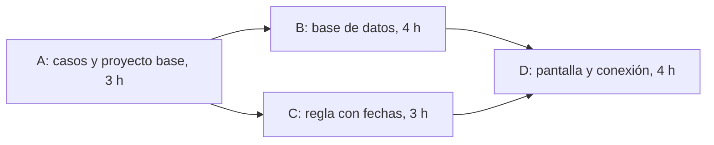

# Sesiones 8 y 9 — Plan del siguiente incremento

- Proyecto: SergioCorp / astra-rent-system
- Integrantes: Sofia Arduz Rengel, Andres Laura Vargas, Peter Uriel Terán Bedregal
- Fecha: 06/10/2026

## 1. Fuentes y flujo elegido

- Sesión 6: [sesion-06-requisitos.md](sesion-06-requisitos.md)
- Sesión 7: [sesion-07-modelos.md](sesion-07-modelos.md)
- Flujo: PRE-CU-01 — el cliente renta un equipo (ruta principal y excepción E1).
- IDs: PRE-RF-01 (el primero en confirmar se queda el equipo) y PRE-RC-01 (mensaje con la causa del rechazo). PRE-RF-04 está relacionado, pero queda fuera de este incremento.
- Lo que ya existe: `rent_manager` (PB-01, datos en memoria) rechaza un segundo préstamo **activo** del mismo equipo. Pruebas: 21 pasan y 4 se saltan.
- Brecha: el código no usa fechas, así que no acepta dos rentas del mismo equipo en periodos distintos ni detecta un cruce. Tampoco hay proyecto Django, base de datos ni pantalla.
- Cambios en requisitos: ninguno. Se conservan los IDs de las sesiones 6 y 7.

## 2. Alcance del incremento

- **Incluye:**
  - Renta aceptada: C-01 renta EQ-01 del 09/10/2026 18:00 al 12/10/2026 09:00. La renta queda confirmada y guardada en PostgreSQL.
  - Rechazo E1: C-02 pide EQ-01 para el mismo periodo. Se rechaza indicando el equipo y las fechas (PRE-RC-01).
  - Datos que se conservan: queda una sola renta de EQ-01 en ese periodo (la de C-01), sin cambios, y no se crea renta para C-02.
  - Una pantalla web para pedir la renta y ver la confirmación o el rechazo.
- **Caso límite:** el caso límite de la sesión 6 (devolución a las 09:05) es de otro flujo. El de este flujo es una renta que empieza después de que termina otra, sin cruzarse. Queda como duda: el equipo devuelto pasa a revisión (PRE-RF-04) y no está acordado cuándo puede rentarse otra vez.
- **Fuera de este incremento (sigue en el proyecto):** inicio de sesión (E2), equipo en revisión (PRE-RF-04), renta no recogida (PRE-RF-03), devolución (PRE-RF-02), renta por operador, combos, horarios 18:00/09:00, duración máxima, multas y pagos, prueba de carga.
- **Dependencias:**
  - Django y PostgreSQL no están instalados en ninguna máquina. Preparación acotada: se instalan en la tarea A.
  - No existe registro de equipos ni de clientes. Se usan datos de demostración.
- **Supuestos:**
  - Datos fijos de demostración: EQ-01, C-01 y C-02, cargados desde un archivo de datos.
  - Sin inicio de sesión: en la pantalla, el cliente se elige de una lista.
  - PostgreSQL se instala directamente, sin Docker.
  - Disponibilidad: los tres, de noche desde las 20:00. Se calcula con una ventana continua en horas desde t = 0, sin fechas prometidas.
- **Dudas pendientes del cliente:**
  - ¿Qué texto ve el cliente que no consigue el equipo? (PRE-RC-01, ENT-21)
  - ¿Cuándo puede rentarse otra vez un equipo devuelto? (PRE-RF-04, caso límite)
  - ¿Los horarios 18:00 y 09:00 son fijos o los elige el cliente? (ENT-19)
  - ¿Entran las rentas con anticipación, aunque el encargo las excluye? (ENT-26)

## 3. Tareas

| Tarea | Trabajo | Evidencia de terminación | Esfuerzo (h-p) | Duración (h) | Predecesoras | Responsable | Razón de la estimación / qué la cambiaría |
|---|---|---|---:|---:|---|---|---|
| A | Acordar los casos y los datos de demostración; crear el proyecto Django con PostgreSQL | Casos escritos en el PR; los tres levantan el proyecto en su máquina; pytest sigue en 21 pasan / 4 se saltan | 9 | 3 | Ninguna | Los tres, en llamada | Nadie instaló Django ni PostgreSQL; son dos Windows y un Linux. Baja si la instalación sale a la primera. |
| B | Modelos de equipo, cliente y renta; restricción en la base contra rentas cruzadas; carga de EQ-01, C-01 y C-02 | `migrate` y la carga de datos funcionan; una prueba muestra que la base rechaza la renta cruzada; PR revisado por Sofia | 5 (4 Peter + 1 Sofia) | 4 | A | Peter | Primera vez con modelos de Django y con la restricción de exclusión. Sube si la restricción necesita más investigación. |
| C | La regla de `rent_manager` compara fechas; mensaje de rechazo con equipo y fechas | Pasan las pruebas del caso aceptado, del cruce y de la conservación de datos; las pruebas anteriores siguen pasando; PR revisado por Sofia | 4 (3 Andrew + 1 Sofia) | 3 | A | Andrew | Es parecido a PB-01, que ya hicimos; lo nuevo son las fechas. Sube si hay que cambiar muchas pruebas anteriores. |
| D | Sofia: pantalla de renta, confirmación y rechazo (reemplaza la página de bienvenida de Django). Andrew: vista que usa la regla de C y guarda con B. Al final, revisión de los tres | En el navegador, C-01 renta EQ-01 y C-02 es rechazado; README con instrucciones; pytest pasa en `main` | 9 (3 Sofia + 3 Andrew + 3 revisión) | 4 | B y C | Sofia y Andrew | Primera pantalla y primera conexión entre las partes: 3 h en paralelo y 1 h de revisión conjunta. Sube si la integración revela cambios en B o C. |

## 4. Red, cálculo y Gantt

Tiempos en horas desde t = 0. Meta del recorrido hacia atrás: 11 h.

| Tarea | Duración | IT | FT | ITa | FTa | Holgura |
|---|---:|---:|---:|---:|---:|---:|
| A | 3 | 0 | 3 | 0 | 3 | 0 |
| B | 4 | 3 | 7 | 3 | 7 | 0 |
| C | 3 | 3 | 6 | 4 | 7 | 1 |
| D | 4 | 7 | 11 | 7 | 11 | 0 |

- D comienza en max(7, 6) = 7. A debe terminar a más tardar en min(3, 4) = 3.
- Ruta crítica: **A → B → D** = 3 + 4 + 4 = **11 h**. La otra ruta, A → C → D, suma 10 h.
- C tiene 1 h de holgura bajo estos supuestos.
- Esfuerzo total: **27 h-p**. Duración inicial: **11 h**.

| Tarea | 0–1 | 1–2 | 2–3 | 3–4 | 4–5 | 5–6 | 6–7 | 7–8 | 8–9 | 9–10 | 10–11 |
|---|---|---|---|---|---|---|---|---|---|---|---|
| A | ■ | ■ | ■ | | | | | | | | |
| B | | | | ■ | ■ | ■ | ■ | | | | |
| C | | | | ■ | ■ | ■ | | | | | |
| D | | | | | | | | ■ | ■ | ■ | ■ |

## 5. Disponibilidad

- B (Peter) y C (Andrew) se hacen a la vez con personas distintas: no hay conflicto.
- Sofia revisa los dos PR en momentos distintos: el de C entre t = 5 y 6, el de B entre t = 6 y 7. No se solapan.
- En D, Sofia y Andrew trabajan cada uno en su parte; la última hora la hacen los tres juntos.
- A y el cierre de D necesitan a los tres a la vez, en un horario desde las 20:00.
- Contingencia: si Peter falta, Andrew hace B después de C (C de 3 a 6, B de 6 a 10, D de 10 a 14). El final pasa de **11 a 14 h** porque B está en la ruta crítica.

## 6. Riesgos

| Riesgo | Probabilidad y razón | Consecuencia | Respuesta previa | Señal y contingencia | Responsable |
|---|---|---|---|---|---|
| La instalación de Django o PostgreSQL falla en alguna máquina | Alta: nadie la hizo antes y son tres máquinas con dos sistemas operativos | A se alarga y retrasa todo, porque está en la ruta crítica | Instalar juntos en la llamada de A siguiendo una sola guía, sin Docker | Si al cerrar A alguien no levanta el proyecto, trabaja en par con otro integrante y se actualiza el calendario | Peter |
| El cliente responde una regla distinta a la supuesta (texto del rechazo, horarios, revisión) | Media: esas preguntas siguen sin respuesta | Cambian las pruebas de C y el mensaje de D | Preguntar a Sergio el jueves; marcar lo pendiente con `skip`, como en la Sesión 04 | Si cambia un caso acordado en A, se corrigen los casos y las estimaciones antes de cerrar C | Andrew |

## 7. Entregable, hito y estado real

- **Entregable:** una versión en `main` con el flujo de renta en Django y PostgreSQL, sus pruebas y las instrucciones para ejecutarlo.
- **Hito verificable:** revisión de los tres sobre la misma versión de `main`. Debe verse que C-01 renta EQ-01 (09/10 18:00 a 12/10 09:00) y queda confirmada, que C-02 es rechazado con la causa, que la base guarda una sola renta de EQ-01 y que pytest pasa.

| Tarea | Estado | Evidencia o explicación |
|---|---|---|
| A | no iniciada | Hoy solo se planificó; nada está instalado. |
| B | no iniciada | No existe el proyecto Django. |
| C | no iniciada | `rent_manager` sigue como PB-01. |
| D | no iniciada | No hay pantalla. |

- Horas reales: no registradas.

## 8. Siguiente paso

- Acción: hacer la tarea A en llamada desde las 20:00 del miércoles 07/10/2026.
- Responsable: Peter convoca la llamada.
- Revisión del plan: después de la presentación del jueves 08/10/2026, con las respuestas de Sergio.
- Condición que obliga a revisar el plan: que Sergio pida otro alcance para el incremento (por ejemplo, todos los PRE-01 a PRE-08 o el inicio de sesión), o que A termine con alguien sin poder levantar el proyecto.